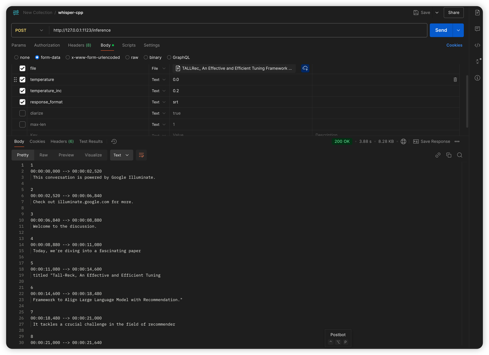

# Podcast Player with Translation

本项目是一个基于 Electron 开发的播客播放器，专注于提供优质的音频播放和实时翻译体验。项目最初源于满足个人论文阅读需求，通过 Google NotebookLM 生成论文相关播客音频，并提供完整的音频播放、字幕显示和实时翻译功能。

## 🌟 主要特性

### 🎵 音频播放
- 支持多种音频格式（MP3, WAV, AAC等）
- 提供完整的播放控制：播放/暂停、音量调节、进度控制
- 支持快进/快退和播放速度调节
- 记忆播放位置，支持断点续播

### 📝 字幕功能
- 支持实时音频转写，自动生成字幕
- 双语字幕同步显示
- 当前播放词句智能高亮

### 🌐 翻译服务
- 支持多种翻译引擎：
  - Google 翻译：适用于通用场景
  - SiliconCloud 大模型翻译：提供更准确的专业领域翻译
  - Ollama 本地模型翻译：支持离线翻译，无需联网
- 实时翻译功能，支持逐句翻译
- 单词级别翻译（双击单词获取释义）
- 智能缓存翻译结果，提高响应速度

### 💾 TTS语音合成
- 支持中文TTS播放功能
- 使用SiliconCloud的语音合成服务
- 支持自定义TTS模型选择
- 逐句播放翻译后的中文内容
- 播放时自动高亮当前朗读的字幕
- 支持随时停止/继续播放

### 💾 数据管理
- 自动保存播放历史
- 字幕文件本地缓存
- 支持音频文件管理
- 支持历史记录搜索和过滤

## 🖼️ 界面预览

### 播放器主界面


### 功能演示


## 🚀 快速开始

### 环境要求
- Node.js >= 14.0.0
- npm >= 6.0.0
- macOS 10.15+ (目前主要支持 macOS 平台)

### 安装步骤

1. 克隆项目
```bash
git clone https://github.com/reilxlx/electron-podcast-player.git
cd electron-podcast-player
```

2. 安装并配置 Ollama（macOS）
```bash
# 使用 Homebrew 安装 Ollama
brew install ollama
# 或者在 https://github.com/ollama/ollama 下载macos版本的ollama安装包

# 启动 Ollama 服务
ollama serve
ollama pull qwen2.5:0.5b    # 通义千问2.5模型，支持中英翻译，可选用其他模型
```

可使用postman测试是否大模型部署成功，请求地址：http://localhost:11434/api/chat
```json
{
    "model": "qwen2.5:0.5b",
    "temperature": 0.7,
    "top_p": 0.9,
    "frequency_penalty": 0.2,
    "presence_penalty": 0.1,
    "max_tokens": 2048,
    "messages": [
        {
            "role": "system",
            "content": "你是一个专业的翻译助手。请将以下文本准确流畅地翻译成中文，保持原文的语气和风格。只返回翻译结果，不要有任何解释或额外的内容。"
        },
        {
            "role": "user",
            "content": "Imagine fine tuning an LLM to be more creative by amplifying certain super activations or making it more analytical by suppressing others. It's like having a set of tuning knobs for different aspects of intelligence."
        }
    ],
    "stream": false
}
```
若输出正常返回信息，则表明ollama模型部署成功。

3. 安装并配置whisper.cpp
```bash
# 下载whisper.cpp
git clone https://github.com/ggerganov/whisper.cpp.git
cd whisper.cpp
sh ./models/download-ggml-model.sh base.en
# build the project
cmake -B build
cmake --build build --config Release
# transcribe an audio file
./build/bin/whisper-cli -m models/ggml-base.en.bin -f audio/test.mp3

# 以server方式启动whisper.cpp服务
./build/bin/whisper-server -m ./models/ggml-base.en.bin --port 1123
```

使用postman测试是否whisper.cpp服务部署成功，请求地址：http://localhost:1123/inference



4. 创建必要的目录结构
```bash
mkdir -p podcast_data/{audio,subtitles}
touch podcast_data/audio_index.json
touch podcast_data/config.json
```

5. 配置 API Keys
在 `podcast_data/config.json` 中配置必要的 API 密钥：
```json
{
  "asr_api_key": "your_asr_api_key_here",
  "silicon_cloud_api_key": "your_silicon_cloud_api_key_here",
  "silicon_cloud_model": "Qwen/Qwen2.5-7B-Instruct",
  "silicon_cloud_summary_model": "THUDM/glm-4-9b-chat",
  "silicon_cloud_TTS_name": "RVC-Boss/GPT-SoVITS",
  "ollama_model": "qwen2.5:0.5b"
}
```

API 获取方式：
- AssemblyAI API Key: [https://www.assemblyai.com/](https://www.assemblyai.com/)
- SiliconCloud API Key: [https://cloud.siliconflow.cn/](https://cloud.siliconflow.cn/)

6. 安装依赖
```bash
npm install --save-dev electron electron-builder
npm install assemblyai node-fetch@2
```

7. 运行应用
```bash
# 开发环境
npm start

# 打包 macOS 应用
npm run build:mac
```

## 📖 使用指南

### 基本操作
1. **添加音频**
   - 点击界面中的"添加音频"区域
   - 选择本地音频文件
   - 支持拖拽文件导入

2. **音频转写**
   - 导入音频后自动开始转写
   - 右键点击 Assembly 转录按钮可配置 API Key
   - 转写完成后自动显示字幕

3. **翻译设置**
   - 界面顶部选择翻译引擎
   - 可选择 Google 翻译、SiliconCloud 或 Ollama 本地翻译
   - 使用 Ollama 翻译时确保本地服务已启动
   - 右键点击翻译按钮可配置相应服务
   - 支持实时切换翻译服务

4. **字幕互动**
   - 双击单词获取翻译
   - 字幕自动跟随音频滚动

5. **TTS播放**
   - 右键点击"中文TTS"按钮
   - 可选择"设置模型"配置TTS模型
   - 点击"TTS播放"开始朗读中文翻译
   - 再次点击可停止播放
   - 播放时自动高亮当前朗读内容

## 🔧 项目结构

```
src/
├── main.js                # Electron 主进程
├── preload.js            # 预加载脚本
├── renderer/             # 渲染进程
│   ├── index.html       # 主界面
│   ├── renderer.js      # 渲染逻辑
│   ├── styles.css       # 样式表
│   └── ui.js            # UI 交互
└── services/            # 核心服务
    ├── fileService.js        # 文件处理
    ├── player.js            # 播放控制
    ├── subtitleParser.js    # 字幕解析
    ├── transcriptionService.js  # 语音转写
    ├── translationService.js   # 翻译服务
    ├── ollamaTranslationService.js  # Ollama本地翻译服务
    ├── summaryService.js      # 内容总结
    └── ttsService.js         # TTS语音合成
```

## ⚠️ 注意事项

1. **API 使用限制**
   - 注意 API 调用频率限制
   - 建议合理使用翻译缓存
   - 大文件转写可能需要较长时间
   - Ollama 本地翻译无调用限制，但首次加载模型需要一定时间

2. **Ollama 使用说明**
   - 确保系统内存充足（建议 16GB 以上）
   - 首次使用时需要下载模型，大小约 4-8GB
   - 模型下载完成后支持离线使用
   - 如遇到翻译质量问题，可尝试切换不同模型
   - Ollama 服务默认端口为 11434，确保未被占用

3. **兼容性说明**
   - 目前主要支持 macOS 平台
   - Ollama 要求 macOS 12.0 或更高版本
   - 音频格式建议使用 MP3 或 WAV

4. **最佳实践**
   - 定期备份重要的翻译和字幕数据
   - 使用高质量音频源以获得更好的转写效果
   - 优先使用 Google NotebookLM 生成的音频以获得最佳体验

## ⭐ 支持项目

如果这个项目对你有帮助，欢迎给个 Star⭐！这将鼓励我们持续改进项目