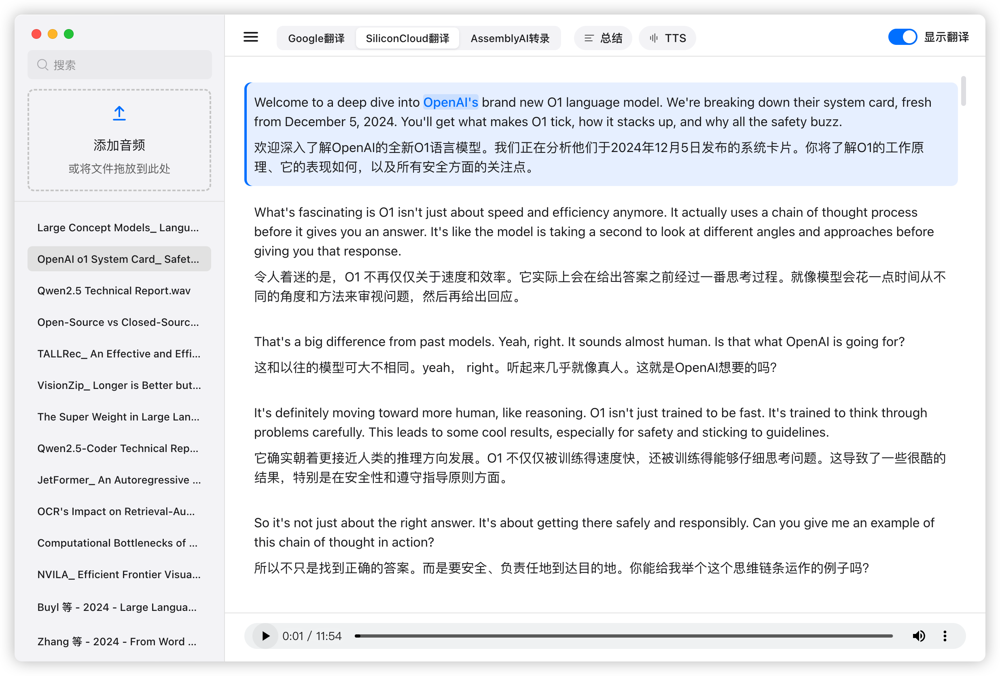

# Podcast Player with Translation

本项目旨在满足个人论文阅读需求，通过Google NotebookLM生成论文相关播客音频。项目提供一个支持英文-中文翻译的播客播放器。该播放器具有音频播放、同步字幕显示以及实时翻译功能，建议导入Google NotebookLM生成的音频文件以获得最佳体验，其他音频文件可能存在兼容性问题。 (访问Google NotebookLM: https://notebooklm.google.com/)

## 功能特点

- 音频播放：支持常见音频格式的播放，提供播放、暂停、进度控制等基本功能。
- 字幕显示：实时显示音频对应的字幕，支持双语字幕同步显示。
- 实时翻译：集成多种翻译服务，包括 Google 翻译、SiliconCloud大模型翻译，可实时翻译字幕内容，双击翻译指定单词。
- 同步高亮：在字幕中对当前播放的单词进行高亮显示，方便用户跟随。
- 字幕缓存：自动缓存已翻译的字幕，减少重复翻译带来的延迟。
- 历史记录：记录用户的播放历史，支持搜索便于快速访问之前的内容。

## 演示

### 界面预览


### 功能演示


## 使用步骤

1. 克隆仓库： 
```bash
git clone https://github.com/reilxlx/electron-podcast-player.git
cd electron-podcast-player
```

2. 申请API Key：
- SiliconCloud API：从 SiliconFlow 平台获取 （https://cloud.siliconflow.cn/）
- ASR API：从 AssemblyAI 获取 （https://www.assemblyai.com/）

```json
{
  "asr_api_key": "your_asr_api_key_here",
  "silicon_cloud_api_key": "your_silicon_cloud_api_key_here",
  "silicon_cloud_model": "Qwen/Qwen2.5-7B-Instruct"
}
```

在 `podcast_data/config.json` 文件中填写 API 密钥。

3. 安装依赖
```bash
npm install --save-dev electron electron-builder
npm install assemblyai node-fetch@2
```

4 运行项目
```bash
# 开发环境运行
npm start
# 打包 macOS 应用（同时生成 dmg 和 zip）
npm run build:mac
```

5. 使用方法：
- 点击添加音频区域选择需要播放的音频文件
- 默认调用Assembly提供的转录服务，右键点击Assembly转录按钮可配置API Key
- 界面上方选择选择所需的翻译引擎，Google翻译或SiliconCloud翻译，右键点击SiliconCloud翻译按钮可配置API Key和翻译模型
- 右键点击文件名，可进行翻译、删除等操作
- 使用播放控制按钮控制音频播放
- 查看实时字幕和翻译结果，双击字幕右键可翻译指定单词，对应调用指定的翻译方式
- 播放历史记录，支持文件名搜索


## 项目结构
```
src/
├── main.js             # Electron 主进程
├── renderer/          # 渲染进程
│   ├── index.html    # 主界面
│   ├── renderer.js   # 渲染逻辑
│   ├── styles.css    # 样式表
│   └── ui.js         # UI 交互
└── services/         # 核心服务
    ├── fileService.js       # 文件处理
    ├── player.js           # 播放控制
    ├── subtitleParser.js   # 字幕解析
    ├── transcriptionService.js # 语音转写
    └── translationService.js  # 翻译服务 
```

## 注意事项

- 翻译服务可能有 API 调用限制，请注意使用频率
- 翻译结果可能存在偏差，请根据实际情况使用

## 如果该项目对你有帮助，烦请点一个Star⭐，感谢！